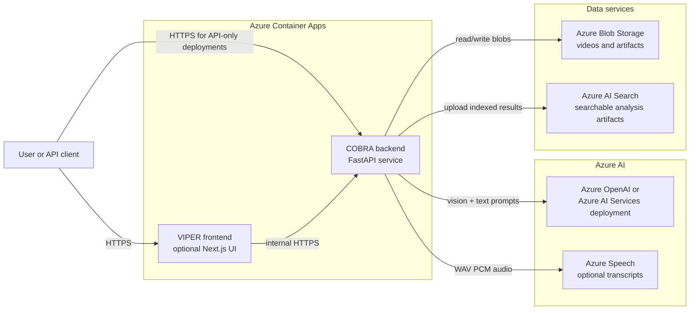
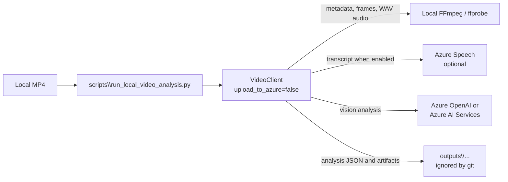
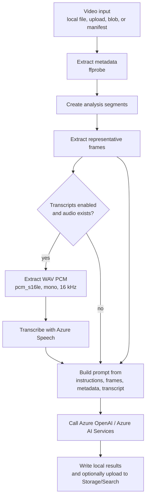
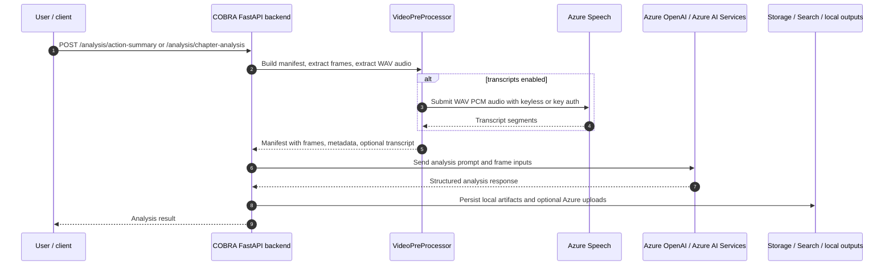

# Architecture

COBRA/VIPER has two layers:

- **COBRA**: Python package and FastAPI backend for video preprocessing, transcription, prompt generation, model calls, and optional Azure artifact upload.
- **VIPER**: optional Next.js UI for users who need a browser experience on top of the COBRA API.

Azure deployment is the primary hosted path. Local validation is a convenience path after Azure OpenAI/Azure AI Services and Speech resources already exist.

## Component map

| Component | Path | Responsibility |
| --- | --- | --- |
| COBRA package | `src\cobrapy` | Video metadata extraction, segmentation, frame/audio extraction, transcription, analysis orchestration |
| FastAPI backend | `src\cobrapy\api\app.py` | Upload and analysis endpoints |
| Analysis configs | `src\cobrapy\analysis` | Action Summary and Chapter Analysis prompt/result definitions |
| Azure integration | `src\cobrapy\azure_integration.py` | Optional Blob Storage and Azure AI Search upload |
| Azure credentials | `src\cobrapy\azure_credentials.py` | Shared local/deployed Entra credential chain |
| Local validation runner | `scripts\run_local_video_analysis.py` | Real local MP4 smoke test path |
| Notebook sample | `samples\cobra_sample_usage.ipynb` | Interactive local validation path |
| VIPER UI | `src\ui` | Optional Next.js frontend with NextAuth and PostgreSQL-backed UI state |
| Azure infrastructure | `infra\main.bicep`, `azure\containerapps.bicep`, `azure.yaml` | Container Apps, ACR, Storage, Search, deployment hooks |

## Hosted Azure topology



The backend is the core service. The frontend is optional and can be disabled with `ENABLE_FRONTEND=false` for backend-only COBRA API deployments.

## Local validation topology



Local validation does not initialize Storage or Search unless remote blob input requires Storage. Generated files should stay under `outputs\` or `samples\local-test\`.

## Video analysis pipeline



1. **Input selection**
   - Local file path, uploaded file, remote blob URL, or existing manifest.
2. **Metadata extraction**
   - `ffprobe` reads video/audio stream metadata.
3. **Segmentation**
   - Video is split into analysis segments according to segment length and FPS settings.
4. **Frame extraction**
   - FFmpeg extracts representative frames for each segment.
5. **Audio extraction**
   - When audio exists and transcripts are enabled, FFmpeg extracts Speech-compatible WAV PCM: `pcm_s16le`, mono, 16 kHz, `-f wav`.
6. **Speech transcription**
   - Azure Speech creates transcript text and segment timing. Entra ID auth uses `aad#<resourceId>#<token>`.
7. **Prompt generation**
   - The selected analysis config combines instructions, frames, optional transcript text, and metadata.
8. **Azure OpenAI analysis**
   - The backend calls the configured deployment. API key auth is optional; blank keys use Entra ID.
9. **Result persistence**
   - Results are written locally, and optionally uploaded to Storage/Search when cloud upload is enabled.

## Key runtime classes

| Class/module | Responsibility |
| --- | --- |
| `VideoClient` | Public orchestration wrapper for preprocessing, analysis, cleanup, and optional cloud upload |
| `VideoPreProcessor` | Segment/frame/audio extraction and manifest updates |
| `VideoAnalyzer` | Prompt creation, Azure OpenAI calls, result parsing, output writing |
| `CobraEnvironment` | Runtime configuration loaded from `.env` and process environment |
| `AzureStorageManager` | Blob upload/download for source and generated artifacts |
| `AzureSearchUploader` | Search upload path for generated artifacts |

## Authentication model

COBRA prefers keyless Entra ID authentication:

1. `AzureDeveloperCliCredential` for local development
2. `AzureCliCredential` for local development and tenant-isolated CLI sessions
3. `ManagedIdentityCredential` for Azure Container Apps

Azure OpenAI uses `azure_ad_token_provider` when `AZURE_OPENAI_GPT_VISION_API_KEY` is blank.

Azure Speech requires `AZURE_SPEECH_RESOURCE_ID` for keyless auth because the Speech SDK expects authorization tokens in this format:

```text
aad#<resourceId>#<token>
```

Deployment-time RBAC for bring-your-own AI resources is handled by `azure.yaml` postprovision hooks:

| Resource ID variable | Role assigned to backend managed identity |
| --- | --- |
| `AZURE_OPENAI_GPT_VISION_RESOURCE_ID` | `Cognitive Services OpenAI User` |
| `AZURE_SPEECH_RESOURCE_ID` | `Cognitive Services User` |

## API surface

| Method | Path | Purpose |
| --- | --- | --- |
| `POST` | `/videos/upload` | Upload a video locally or to Azure Storage |
| `POST` | `/analysis/action-summary` | Preprocess and run Action Summary analysis |
| `POST` | `/analysis/chapter-analysis` | Preprocess and run Chapter Analysis |

The API can accept a source video path or a pre-generated manifest path depending on the request.

## Request flow



## Deployment infrastructure

Deployment is driven by:

- `azure.yaml` for azd services and hooks
- `infra\main.bicep` as the subscription-scoped entry point
- `azure\containerapps.bicep` for Container Apps, networking, Storage, Search, and role assignments

The first-run ACR bootstrap pattern is:

1. provision Container Apps with public placeholder images
2. create identities and role assignments
3. configure Container Apps registry access in `postprovision`
4. deploy real backend/frontend images with `azd deploy` or `azd up`

Cosmos DB is disabled by default because the current backend runtime does not require it.

## Boundaries and non-goals

- COBRA local validation is not a mock mode. It still uses real Azure OpenAI and, when enabled, real Azure Speech.
- VIPER UI is optional for backend-only deployments.
- API keys remain optional where Entra ID is supported.
- Generated media, local outputs, `.env`, and Bicep build output are not source artifacts and should not be committed.
